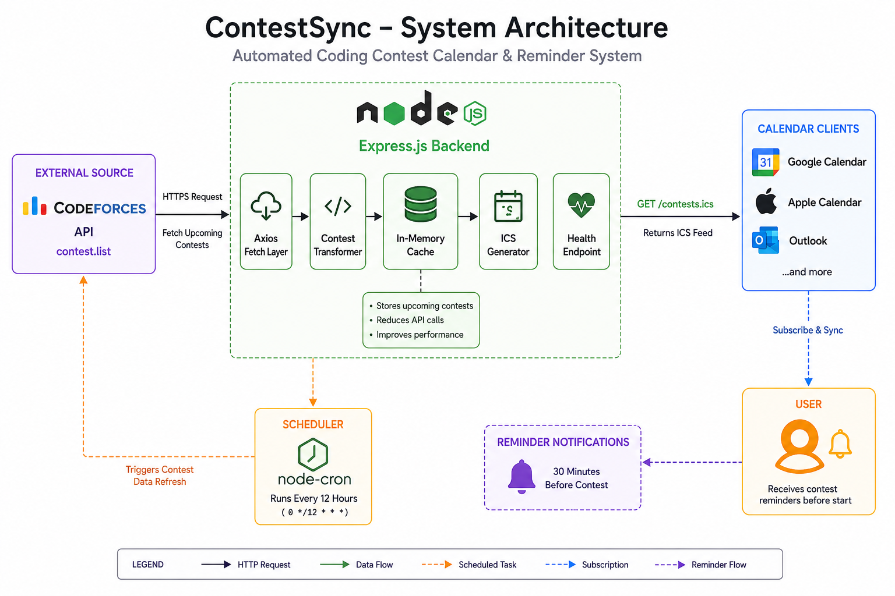

<h1 align="center">Contest Calendar Sync & Reminder System</h1>

  Automatically sync upcoming coding contests to <b>Google Calendar</b> and get <b>contest reminders before they start</b>.

<h2>🚀 Overview</h2>

<b>Contest Calendar Sync & Reminder System</b> is a lightweight backend service that fetches upcoming programming contests from <b>Codeforces</b>, generates a standards-compliant <b>iCalendar (ICS) feed</b>, and allows users to subscribe directly from <b>Google Calendar</b>, <b>Apple Calendar</b>, or <b>Outlook</b>.

The service refreshes contest data automatically and supports reminder notifications before contest start time.

<h2>✨ Features</h2>

<ul>
  <li>📅 Fetches upcoming contests from the <b>Codeforces API</b></li>
  <li>🔄 Auto-refreshes contest data every <b>12 hours</b></li>
  <li>📥 Generates <b>ICS calendar feeds</b></li>
  <li>📱 Works with <b>Google Calendar, Apple Calendar, Outlook</b></li>
  <li>⏰ Adds <b>pre-contest reminder notifications</b></li>
  <li>⚡ Uses caching to reduce external API calls</li>
  <li>❤️ Simple health-check endpoint for monitoring</li>
</ul>

<h2>🏗️ Backend Architecture</h2>

  

  <i>Backend architecture of ContestSync showing contest fetching, caching, ICS generation, calendar synchronization, and reminder notifications.</i>

<h2>📅 Add to Google Calendar</h2>

<ol>
  <li>Start the server.</li>
  <li>Copy the feed URL:</li>
</ol>

<pre><code>https://calendar-contests.onrender.com/contests.ics</code></pre>
<pre><code>https://leetcode-calendar.onrender.com/contests.ics</code></pre>
<ol start="3">
  <li>Open <b>Google Calendar</b>.</li>
  <li>Go to <b>Settings → Add calendar → From URL</b>.</li>
  <li>Paste the URL and click <b>Add calendar</b>.</li>
</ol>

Upcoming contests will appear automatically.

<h2>🛠️ Tech Stack</h2>

<ul>
  <li>Node.js</li>
  <li>Express.js</li>
  <li>Axios</li>
  <li>ical-generator</li>
  <li>node-cron</li>
  <li>Google Calendar (ICS)</li>
  <li>CORS</li>
</ul>

<h2>▶️ Run Locally</h2>

<pre><code class="language-bash">npm install
npm start</code></pre>

Server will run at:

<pre><code>http://localhost:5000</code></pre>

<h2>📌 API Endpoints</h2>

<h3>Health Check</h3>

<pre><code class="language-http">GET /</code></pre>

<h3>Calendar Feed</h3>

<pre><code class="language-http">GET /contests.ics</code></pre>

Returns a valid <b>ICS calendar file</b>.

  ⭐ If you found this project useful, please <b>star the repository</b>.

